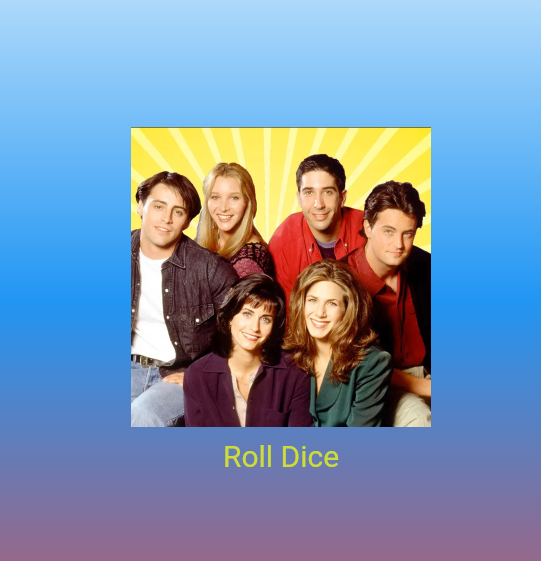

# Лабораторная работа №4-5. Flutter: структура UI и компонентный подход

**ФИО:** Куриев Артур Майрбекович
**Группа:** ИСП-241
**Дата:** 05.10.2026

## Что изучил

* Создание интерфейса с помощью виджетов
* Создание `StatelessWidget` и `StatefulWidget`
* Разделение кода на несколько файлов
* Передачу данных через параметры
* Работу с изображениями и случайными числами

## Финальное приложение

## Репозиторий

[Мой репозиторий на GitHub](https://github.com/APTYPMORGAN/Flutter_Widgets)

## Как запустить проект

1. Открыть папку проекта в VS Code
2. Открыть терминал
3. Выполнить команду: `flutter pub get`
4. Запустить приложение: `flutter run -d chrome`

## Ответы на вопросы

### 1. Зачем выносить виджеты в отдельные файлы?

Так код становится более понятным и удобным.
Если всё хранить в `main.dart`, файл быстро станет большим и в нём будет сложнее искать нужный код

### 2. Что такое BuildContext?

`BuildContext` содержит информацию о месте виджета в дереве Flutter
Он нужен методу `build()` для правильного построения интерфейса

### 3. Чем StatelessWidget отличается от StatefulWidget?

`StatelessWidget` используется для виджетов, которые не меняются.

`StatefulWidget` используется, когда данные на экране могут изменяться.

### 4. Почему Random() создаётся на уровне файла?

Чтобы не создавать новый генератор случайных чисел при каждом нажатии кнопки
Один объект `Random` можно использовать несколько раз